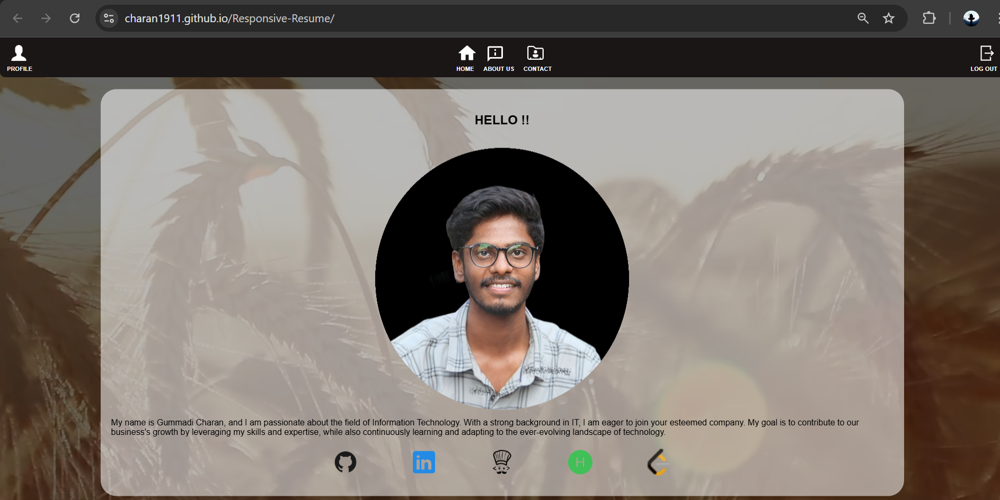
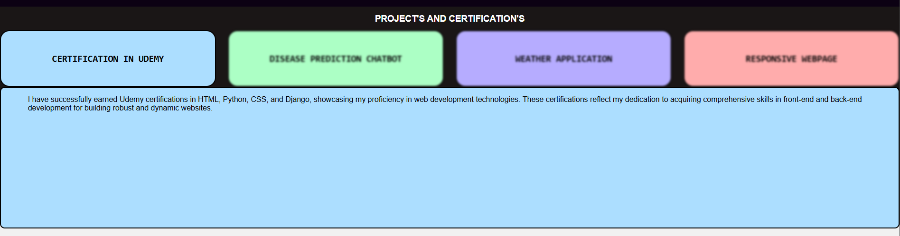

# Responsive Resume

A simple, responsive resume website built using HTML, CSS, and JavaScript.

## Features
- Simple and clean static resume design.
- Lightweight and fast loading, with no dependencies on backend frameworks.
- Built with plain HTML, CSS, and minimal JavaScript.
- Easy to edit and customize for different resumes.
- Accessible and mobile-friendly layout for responsive viewing.

## Demo
[Live Demo](https://your-github-username.github.io/Responsive-Resume)

